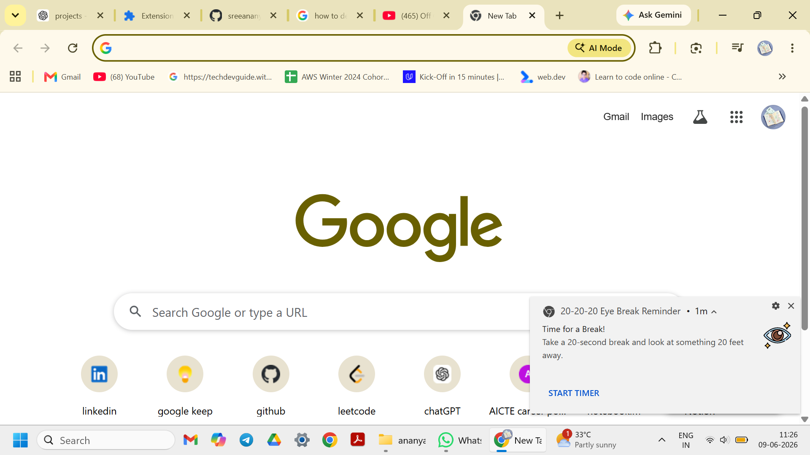
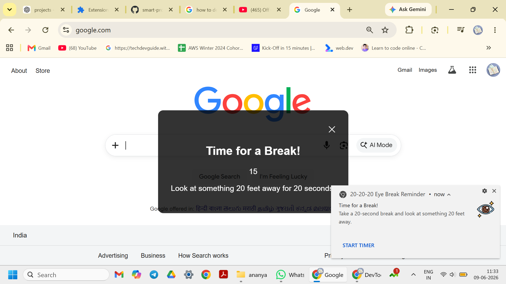

# 👀 20-20-20 Eye Break Reminder

A Chrome Extension designed to promote healthy screen habits using the 20-20-20 rule. The extension reminds users to take regular eye breaks and provides an interactive countdown timer to encourage healthier screen usage.

## 🚀 Features

* Automated eye break reminders using Chrome Notifications
* Interactive "Start Timer" action directly from notifications
* 20-second countdown timer overlay on active browser tabs
* Lightweight and easy-to-use interface
* Built with Chrome Extension Manifest V3

## 🛠️ Technologies Used

* JavaScript
* HTML
* CSS
* Chrome Extension APIs

  * Alarms API
  * Notifications API
  * Scripting API
  * Tabs API
* Manifest V3

## 📸 Screenshots


### Break Reminder Notification



### Countdown Timer Overlay



## ⚙️ Installation

1. Clone the repository

```bash
git clone https://github.com/sreeananya1/smart-productivity-assistant.git
```

2. Open Chrome and navigate to:

```text
chrome://extensions
```

3. Enable Developer Mode.

4. Click **Load unpacked**.

5. Select the project folder.

6. The extension will now be available in Chrome.

## 🎯 Purpose

Prolonged screen exposure can contribute to eye strain and fatigue. This extension helps users follow the widely recommended 20-20-20 rule by reminding them to periodically rest their eyes and focus on distant objects.

## 📌 Future Enhancements

* Custom reminder intervals
* Daily productivity statistics
* Break streak tracking
* Personalized wellness settings
